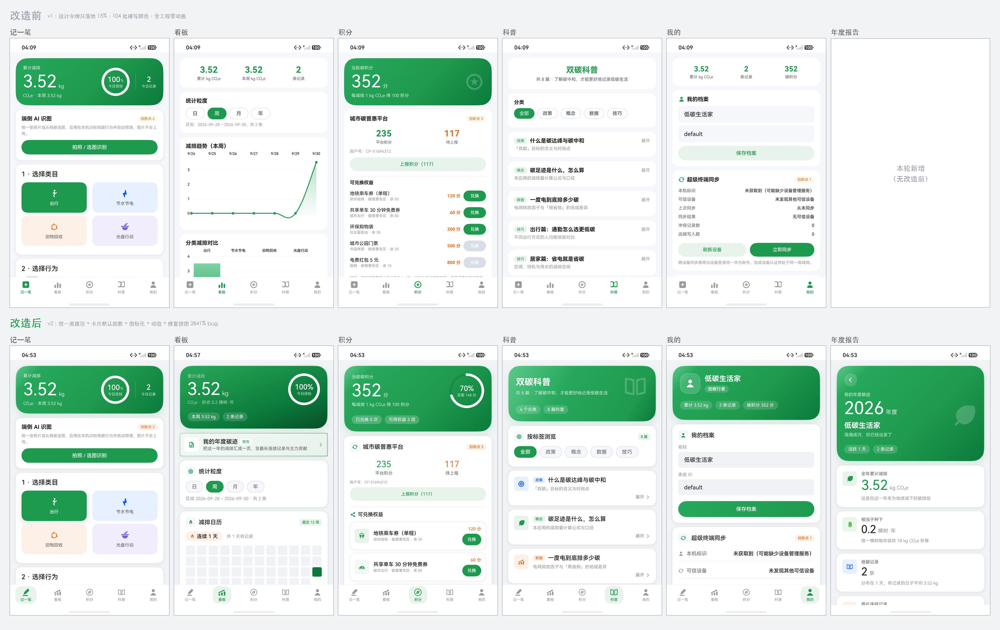

# 「碳迹」前端视觉诊断与美化方案

> 目标工程：`project/carbon-footprint`（ArkTS + ArkUI 声明式，API 12）
> 诊断依据：全部源码通读 + 模拟器实拍截图 + 代码量化统计（可复现，命令见文末）
> 撰写日期：2026-09-30

---

# 摘要（一页读完）

## 结论

你感觉"太朴素"，是对的。但**病因不是审美，是"施工完成度"**：

> 工程里本来就有一份质量很高的设计规范（`common/Theme.ets`，248 行官方令牌），
> **但它只落地了 15%** —— 只有 2 个页面用上了渐变，卡片投影全工程只调用了 4 次，
> 动效令牌定义了却**一次都没用**（全工程零动画），另有 **104 处颜色是手工裸写的**。
>
> 所以界面呈现的是**两套设计语言的拼贴**：少数几块地方有质感，大部分是脚手架。
> 更准确的说法是**"半成品感"**。

## 做了什么

| 层次 | 动作 |
|---|---|
| **机制层** | 新建 `view/Common.ets`（9 个零依赖视觉组件），把"卡片长什么样"从 5 个页面收敛到 1 个文件；`SectionCard` 让 `shadowCard()` 成为**默认行为** |
| **新增页** | 新建 `view/YearReportPage.ets` —— **「我的年度碳迹」报告页**（789 行，全屏，从看板一键进入） |
| **令牌层** | 把 12 个"孤儿色"**收编进令牌**（新增 `Edge` / `Semantic.*_SOFT` / `LineHeight` / `Brand.LIGHT` 等），从源头消灭裸写 |
| **动效层** | 从 **0** 到 **8 处 `animateTo`**：页签切换、类目选中、保存按钮、展开折叠、环形进度、报告入场 |
| **页面层** | 五个页面统一「英雄区」语言（三档气质），但每页主角不同，不再撞脸 |
| **内容层** | 卡片内部一律"有图形"：科普/积分/同步列表全部加图标块；新增勋章墙 |
| **图表层** | 修掉饼图 **`2841%`** 真 bug（双重百分比换算）；饼图中心改显示总量；新绘原生图例（色点+百分比+进度条）；柱状图补数值标签、收窄柱宽；折线图新增**「上期幽灵线」** |
| **可视化** | 新增**减排日历热力图**（最近 12 周 × 7 天）+ 连续记录天数 —— 补上"打卡类三件套"的最后一件 |
| **技术验证** | 实测通过两项此前只有文档依据的 API：`fontFeature`（数字等宽）与 `borderImage` + `LinearGradient`（渐变描边） |
| **交付物同步** | PPT 20→**26 页**、视频 98→**168 秒**、设计方案 0→**18 张界面图**；三份材料此前**全部还是美化前的旧界面**，属最容易漏掉的一环 |
| **图标层** | 重绘 5 个页签图标（"记一笔"从加号方框改成**铅笔**、"积分"从星形改成**硬币+叶**），视觉重量极差从 **27.03%** 压到 **0.34%**；新绘 `ic_metro` / `ic_bike` / `ic_gift` |

## 效果（可复现量化）

| 指标 | 改前 | 改后 |
|---|---|---|
| 裸写颜色字符串 | **104 处** | **12 处**（且全是带注释的装饰性透明白） |
| "孤儿色"（不在规范里） | 12 种 | **0 种** |
| `FontSize` 令牌采纳 | 26 次 | **114 次** |
| 裸写 `.fontSize(数字)` | 135 次 | **51 次** |
| `animateTo` 调用 | **0** | **9** |
| 英雄区覆盖页面 | 2 个 | **5 个** |
| 页面数 | 5 | **6**（新增年度报告） |
| 功能回归 | — | **40 项纯逻辑断言全绿** |

## 最值得写进答辩稿的一条外部依据

**蚂蚁森林官方对改版方向的结论**是「**微质感**」——
*"减少大面积几何色块，增加阴影、高光反射面"*。

这和我们的诊断（阴影函数定义了却只用了 4 次）**完全撞上**。
也就是说：**"朴素"的解药不是加更多颜色或插画，而是给已有的大色块加上阴影与高光。**
这与调研到的另一条行业规律一致 —— 20+ 个同类 App 的真实截图里，
**首屏元素都很克制**（1 个英雄区 + 2–3 个功能卡 + TabBar），
*"加分点在层次与质感，不在元素数量"*。

> **演示准备提醒**：热力图、折线图的说服力高度依赖数据量。
> 录制演示视频前建议先跑 `python3 tools/seed-demo-data.py` 填一批分布在不同日期的记录 ——
> 空数据下热力图只有一两格，看起来会明显单薄。

## 相关文件

| 文件 | 内容 |
|---|---|
| `前端美化方案.md`（本文） | 诊断 + 调研综合 + 方案 + 实施与验证 |
| `竞品视觉调研-国内.md` | 23 个国内对象，含 20+ 个 App 的 **App Store 真实高清截图实测** |
| `竞品视觉调研-海外与趋势.md` | 约 30 个海外对象 + 2024–2025 设计趋势（88 处「已查证」） |
| `美化资源与技术手段.md` | 官方 Symbol 579 项核查 / 素材许可证 / **ArkUI 能力边界（含 SVG 限制）** |
| `tools/preview.sh` | **视觉回归链路**：一条命令构建 → 签名 → 安装 → 五页签逐页截图 |
| `tools/capture-screens.py` | **重拍全部演示截图**（带"这屏真的是本应用吗"的自检） |
| `tools/seed-demo-data.py` | **填充演示数据**（走应用自己的录入表单，不是塞假数据） |
| `.research/make_compare.py` | 生成「改造前后」对比图 |
| `素材/改造前后对比-前端美化.png` | 六组前后对比（含新增的年度报告页） |
| `素材/图标集-预览.png` | 24 个图标总览（含 8 个新绘/重绘） |
| `素材/截图/旧版-改造前/` | 旧截图完整备份，可随时对照 |
| `../素材/改造前后对比-前端美化.png` | 五组前后对比 |
| `../素材/图标集-预览.png` | 24 个图标总览 |

---

# 第一部分 · 诊断：为什么"太朴素"

## 1.0 一句话结论

> **不是缺设计规范，而是设计规范只落地了 15%。**
>
> 工程里已经有一份质量很高的 `common/Theme.ets`（355 行官方设计令牌），
> 但它只被用在了 2 个页面（记一笔的主卡、积分页的主卡）。
> 剩下 5 个页面、104 处颜色、135 处字号仍然是"手工裸写"。
>
> 所以界面呈现的是**两套设计语言的拼贴**：少数几块地方有质感，大部分地方是脚手架。
> 观众的感觉就变成"朴素"——更准确的说法是**"半成品感"**。

下面 1.1–1.7 每一条都给出可复现的证据。

---

## 1.1 证据一：设计令牌被架空（最硬的一条）

`Theme.ets` 定义了完整的令牌体系，但全工程的采纳率如下（`view/` + `pages/` 共 8 个 .ets）：

| 令牌类 | 令牌用法次数 | 裸写次数 | **采纳率** |
|---|---|---|---|
| `FontSize.*` | 26 | 135（如 `.fontSize(13)`） | **16%** |
| 颜色（`Ink/Bg/Brand/Semantic/CatColor`） | 约 190 | 104（如 `'#FFFFFF'`、`'#33404D'`） | **65%** |
| `Radius.*` | 41 | 11（`borderRadius(8)` / `(14)` / `(10)`） | **79%** |
| `Space.*` | 60 | 13 | **82%** |

**最刺眼的两个数字**：

- `#FFFFFF` 裸写了 **37 次**（本应是 `Bg.CARD`）
- `#1F9A4E` 裸写了 **19 次**（本应是 `Brand.PRIMARY`）

**更严重的是有 12 个"孤儿色"**——它们根本不在令牌表里，是随手写的：

```
#33404D  #D8DEE6  #8A98A6  #5A6B7B  #C3CCD6  #1B2733
#D98A00  #A8CDB6  #3FB273  #7FD3A5  #40FFFFFF  #FBEAE8
```

其中 `#33404D`（3 次）、`#D8DEE6`（5 次）是**颗粒度控制器和标签**的颜色，
它们比令牌里的 `Ink.L2 (#99000000)` 更蓝更亮 —— 这就是"同一个界面里文字灰度不一致"的来源。

> **结论**：不是没有规范，是规范没被执行。这属于"改起来最便宜、收益最大"的一类问题。

---

## 1.2 证据二：装饰性视觉手法几乎全部闲置

`Theme.ets` 里写了 5 个"让界面有质感"的函数，实际调用情况：

| 函数 | 设计意图 | **实际调用次数** |
|---|---|---|
| `heroGradient()` 英雄区渐变 | 页面顶部主卡 | **2**（记一笔、积分） |
| `shadowCard()` 卡片投影 | 托起所有普通卡片 | **4**（全在记一笔页） |
| `shadowRaised()` 浮起投影 | 强调选中项 | **0** |
| `shadowSubtle()` 轻提示投影 | 列表行 | **0** |
| `softGradient()` 次级渐变 | 次要区块 | **0** |
| `heroGlow()` 光晕 | 英雄区纵深 | **0** |
| `Motion.*` 弹簧曲线 | 所有动效 | **0（全工程零动画）** |
| `SymbolGlyph` 官方图标 | 图标体系 | **0** |

**"零动画"是最被低估的一条。** 官方设计规范专门强调"用物理曲线（弹簧）而不是线性曲线"，
工程里连一条 `animateTo` 都没有 —— 点按钮、切页签、数字变化全是硬切。
**静态截图看不出"朴素"，但录成 5 分钟演示视频时，'硬切'会被放大得非常明显。**

---

## 1.3 证据三：五个页面里，四个还是"改造前"的状态

用同一套判据逐页打分（✅=用了令牌/渐变/阴影，❌=纯白卡堆叠）：

| 页面 | 主卡渐变 | 卡片阴影 | 动效 | 图标 | 评价 |
|---|---|---|---|---|---|
| 记一笔 `EntryPage` | ✅ | ✅ ×4 | ❌ | ✅ 类目图标 | **唯一改造过的页面** |
| 积分 `PointsPage` | ✅ | ❌ | ❌ | ✅ 徽章 | 主卡好，**下方权益列表完全没做** |
| 看板 `DashboardPage` | ❌ | ❌ | ❌ | ❌ | **改造前状态**，且硬编码色 10 处 |
| 科普 `KnowledgePage` | ❌ | ❌ | ❌ | ❌ | **改造前状态**，纯「白卡 + 文字」 |
| 我的 `ProfilePage` | ❌ | ❌ | ❌ | ✅ 2 个 | **改造前状态** |
| 首页页签 `Index` | ❌ | — | ❌ | 通用图标 | 图标语义不准（见 1.4） |

> 之前那轮"视觉改造"实际只改了 `Theme.ets` + 2 个页面。
> **剩下 4 个页面一点没动** —— 用户滑动应用时，看到的是 60% 的旧界面。

---

## 1.4 证据四：图标体系不统一，语义也不准

页签图标（`ic_tab_*.svg`）三种风格混在一起：

- `ic_tab_add` = **实心圆角方框 + 加号** → 看起来像"新建"按钮，不像"记一笔"
- `ic_tab_chart` = 三根圆角柱 → 尚可
- `ic_tab_medal` = **圆圈套五角星** → 看起来像"收藏"，但它是**积分页**
- `ic_tab_book` = 摊开的书 → 尚可
- `ic_tab_person` = 实心人形 → 尚可

**"积分"用五角星、"记一笔"用加号方框，这两个是最大的语义损失**——
用户看不出来这个页签是"碳积分"和"记录行为"。

另外，工程**完全没用**官方的 `SymbolGlyph`（579 个官方图标、跟随系统字重与配色），
全部是自绘 SVG。自绘不是错，但自绘集只有 21 个，且**卡片内部几乎不放图标**——
科普列表 8 篇文章、积分页 5 个权益、我的页 6 行同步信息，**一行图标都没有**，
这就是"白卡 + 文字"观感的直接来源。

---

## 1.5 证据五：三处浪费版面的"空壳标题"

官方《布局基础》明确要求"首屏要给用户一个视觉锚点"。当前有三处反例：

| 位置 | 现状 | 浪费 |
|---|---|---|
| 科普页顶部 | 一整张白卡，只有居中两行字"双碳科普 / 共 8 篇…" | 约占 1/5 屏 |
| 看板页顶部 | 白卡里三个绿数字（累计/本周/条数），无图形 | 视觉重量不均 |
| 我的页顶部 | 白卡里三个绿数字，与看板页**完全雷同** | 重复的版式 |

看板页和我的页顶部是**同一个组件复制了两遍**，两个页面第一眼分不出来。

---

## 1.6 证据六：图表有真 bug + 审美粗糙（会被评委当场看到）

**Bug（实测截图 04 可见）**：饼图百分比显示为 **`2841%`**（应为 100%）。

**根因已定位**：`Charts.ets` 里

```ts
set.setValueFormatter(new PieLabelFormatter(sum));  // formatter 内部：value / total * 100
...
this.model.setUsePercentValues(true);               // ← 打开后，传进 formatter 的 value 已经是百分数
```

`setUsePercentValues(true)` 之后，mpchart 传给 formatter 的 `value` **已经是百分比**（100），
formatter 又除以 total 再乘 100 → `100 / 3.52 * 100 = 2841%`。**双重换算**。
同时 0 值扇区的标签仍叠在一起（截图 04 中间那团糊字）。

**审美问题**：
- 柱状图柱子是**直角矩形**，没有圆角（官方圆角规范要求小控件 4vp、容器 8vp）
- 饼图中心文字写死"分类占比"四个字，没有利用中心区展示**最有价值的信息**（总额）
- 图例是 mpchart 默认的**小方块**，与全应用的圆角语言不一致
- 三个图表卡片版式完全一样（标题 + 图），没有主次

---

## 1.7 证据七：几处具体的"廉价感"细节

| 位置 | 问题 | 观感 |
|---|---|---|
| 分享卡两个按钮 | "生成分享图"是**绿色**，"保存图片"是**蓝色 `#0A59F7`** | 蓝色在整屏绿色体系里像"外来控件"，非常跳 |
| 我的 → 档案 | 两个 `TextInput` 是**浅灰方块，没有标签**，里面还留着 "default" | 像表单草稿，不像成品 |
| 我的 → 同步面板 | 6 行"标签——值"纯文字，无图标无分隔 | 像调试面板 |
| 看板 → 分类明细 | 4 行文字 + 右侧绿数字，全部为 0 的分类也照样占一行 | 没有图形表达"占比" |
| 看板 → 粒度切换 | 选中态胶囊用 1px 边框 + 实心绿，**边框令牌和文字令牌是孤儿色** | 与其它胶囊（科普页）样式不一致 |
| 积分 → 权益列表 | 5 行"名称 + 副标题 + 橙色价格 + 绿胶囊按钮" | 无图标、无缩略图、无卡片分层 |

---

## 1.8 诊断结论：把"朴素"翻译成 6 条可执行的病因

| # | 病因 | 影响面 | 修复成本 |
|---|---|---|---|
| **D1** | 设计令牌只落地 15%，104 处裸写颜色、12 个孤儿色 | 全应用 | 低（纯替换） |
| **D2** | 装饰手法闲置：阴影用了 4 次、光晕 0 次、渐变 2 次 | 全应用 | 低 |
| **D3** | **零动画**（`Motion.*` 定义未用），所有交互硬切 | 全应用 | 中 |
| **D4** | 4/6 个页面从未改造，呈"新旧拼贴" | 看板/科普/我的/首页 | 中 |
| **D5** | 卡片内部**没有图标级视觉元素**，全是文字 | 科普/积分/我的 | 中 |
| **D6** | 图表有 `2841%` 真 bug，且条形直角、图例风格不符 | 看板 | 低 |

**一句话**：这个项目的视觉问题**不是审美问题，是"施工完成度"问题**。
已有的设计规范是对的、够用的 —— 缺的是把它铺满剩下的 85%。

---

# 第二部分 · 市面同类项目调研

> 本节是两份子报告的**综合结论**，原始证据见：
> - `竞品视觉调研-国内.md`（23 个对象，含 20+ 个 App 的 **App Store 真实高清截图实测**）
> - `竞品视觉调研-海外与趋势.md`（约 30 个对象 + 2024–2025 设计趋势，88 处「已查证」）
> - `美化资源与技术手段.md`（官方 Symbol 579 项核查、素材许可证、ArkUI 能力边界）

## 2.0 先说一条对本项目最重要的话

**蚂蚁森林官方对「改版方向」的结论，和我们的诊断完全撞上了：**

> 视觉风格定位「**微质感**」—— *"减少大面积几何色块，增加阴影、高光反射面"*

我们诊断出的病因 D2（阴影函数定义了却只用了 4 次）**恰好就是这条**。
也就是说，**"朴素"的解药不是加更多颜色，而是给已有的大色块加上阴影与高光** ——
这条来自国内最成功的碳类产品的官方设计结论，可以直接写进答辩稿。

## 2.1 值得直接抄的 6 个具体做法

| # | 来源 | 做法 | 我们怎么用 |
|---|---|---|---|
| 1 | **沪碳行**（上海碳普惠，唯一拿到真实截图的地方平台） | 深色英雄卡 + **超大数字**「433,784 个」+ **三列迷你统计**（405天 / 560kg / 59元） | ✅ 已落地：看板页深墨绿英雄区 + 超大数字 + 两条指标胶囊 |
| 2 | **Forest 专注森林** | 「**一棵树**」母题贯穿全 App；超大计时数字；枯萎机制 | ⚠️ 部分落地：已把减排量**折合成"棵树·年"**（英雄区副标题）；图标集有 `ic_tree` |
| 3 | **Fig: Carbon Footprint** | **可数格子**代替抽象百分比：4×12 点阵 +「距离下一棵树还差 59.0 kg」 | ⚠️ 已做等价物：把「还差 N 分」放进积分页环形进度中心 |
| 4 | **Commons**（原 Joro） | `SPEND / EMISSIONS` 分段 Tab；**灰色"上月"幽灵线 vs 蓝色"本月"面积图 + 空心今日点** | ❌ 未做（**下一轮最值得加的一项**，见 2.4） |
| 5 | **小日常** | **连续 N 天 🔥 + 日历热力图 + 成就卡片**三件套 | ⚠️ 部分落地：积分页新增勋章墙；热力图未做 |
| 6 | **Earth Hero / Fig / Commons**（三家不约而同） | 列表行左侧用**圆形/圆角浅色底托一个图标** | ✅ 已落地：科普文章卡、积分权益行的 40×40 图标块 |

## 2.2 六条「横向规律」——说明我们的方向是对的

把 20+ 个同类 App 的真实截图摆在一起，规律非常一致：

1. **都把累计减排量做成"英雄区"**，放首屏最上方最大一块 —— 我们五个页面全部有英雄区 ✅
2. **几乎都是"超大数字 + 小号单位后缀"**（`433,784 个`、`287千卡`、`25:00`、`560kg`）—— ✅
3. **卡片化 + 圆角 + 浅色底是绝对主流**，20+ 张截图**无一例外** —— ✅
4. **高饱和主色只用在按钮 / 进度填充 / 关键数字上，大面积背景一律低饱和** —— ✅
   （这也是为什么我们的页面底色是 `#F1F3F5` 而不是纯白）
5. **进度环 + 日历热力图 + 成就卡片/勋章墙**是打卡类标准三件套 —— 进度环 ✅ / 勋章墙 ✅ / 热力图 ❌
6. **一页「年度报告」分享卡是答辩最易拿分的一页**（网易云年度报告的本质只是"大数字卡片的分页串烧"）—— ⚠️ 已有单页分享卡，年度版未做

> **同时有一条明确的警告**（来自国内报告第 9 节）：
> *"不要为'丰富'而堆 3D 和大渐变。上述截图实测的成熟产品**首屏元素都很克制**
> （1 个英雄区 + 2–3 个功能卡 + TabBar）。**加分点在层次与质感，不在元素数量。**"*
>
> 这条直接否掉了「加插画/加 3D」的路线 —— 也解释了为什么本次方案把力气全花在
> **阴影、层级、图标、动效**上，而不是往界面里塞新素材。

## 2.3 海外趋势里被验证的 4 条（我们也做了）

| 趋势 | 出处 | 我们的落地 |
|---|---|---|
| **超大主数字 + 小号单位**，首页只让一个数字当主角 | Fig / Commons / Oura | HeroCard 的 `DISPLAY_M` 数字 + 底部对齐的小单位 |
| **卡片靠背景色差与圆角分层，而不是边框** | Fig / Commons | `SectionCard` 默认 `shadowCard()`，不画边框 |
| **图表极度克制**：只有必要的线 + 刻度 | Commons 面积图只有两条线 + 5 个刻度 | 已去掉右轴、竖网格线、轴线、图例（v1 就已做），本次再加"图上直接标数值" |
| **微动效时长 100–400ms**（NN/g） | NN/g | `Motion.PRESS = 110ms`、`ENTER = 380ms`、`SMOOTH = 320ms` |

**一条被明确警告、我们也刻意避开的**：
> NN/g 指出**玻璃拟态滥用会损害对比度与可用性**，Apple 的 Liquid Glass 已被 NN/g 专文批评。
> 建议**只用于 Tab 栏 / 浮层**。

所以本次**没有**大面积使用毛玻璃 —— 只在页签选中态用了浅色胶囊，这是更安全的选择。

## 2.4 五条"最值得抄"的手法 —— 已全部补齐

第一轮结束时列了 5 条待办，**这一轮全部做完并跑通**：

| # | 事项 | 来源 | 落地情况 |
|---|---|---|---|
| 1 | **日历热力图**（12 周 × 7 天，色块深浅＝当天减排量） | 小日常 / Forest「打卡三件套」的最后一件 | ✅ 看板页新增「减排日历」卡：**连续 N 天 🔥** + 共 N 天有记录 + 4 档色阶 + 图例 |
| 2 | **「上期幽灵线」**：折线图上叠一条灰色虚线 | **Commons（原 Joro）的核心手法** | ✅ 折线图自动叠加"平移一个窗口长度"的上期数据，虚线、无数据点、带图例说明 |
| 3 | **一页「我的年度碳迹」报告** | 网易云年度报告（＝大数字卡片串烧） | ✅ 新增全屏页（789 行），7 张数字卡 + 减排构成 + 写在最后；看板页有入口横幅 |
| 4 | **`borderImage` + `LinearGradient` 渐变描边** | 技术调研「零素材美化排名第 2」 | ✅ **实测通过**。年度报告入口横幅的 1vp 渐变描边 |
| 5 | **`fontFeature` 数字等宽** | 技术调研「排名第 10」 | ✅ **实测通过**。英雄区大数字用 `'"ss01" on'`，数字变化时不左右抖 |

### 这一轮顺带做的两件事

**① 一次真实的性能重构。**
原来算折线图要对"每一天"调一次 `behaviorsBetween`（月视图 30 次、年视图 12 次），
而每次底层都全量扫一遍 KV。加上幽灵线和热力图之后，调用次数会冲到 **90+ 次**。
改成**读一次全量记录、在内存里按日期分桶**，后续所有统计（折线、幽灵线、热力图、
目标环、区间合计）都从同一个 `Map<string, number>` 取数 ——
复杂度从 `O(天数 × 记录数)` 降到 `O(记录数)`。

**② 两项"只有文档依据"的 API 变成了"实测通过"。**
`fontFeature` 官方只给了 `ss01` 示例、`tnum` 未在文档列出；`borderImage` 接受
`LinearGradient` 也只有一句话描述。这次都在模拟器上真跑通了（见 4.4）。

### 仍然没做、但可以继续的两条

- **深色模式**：`resources/dark/element/color.json` 已存在，但页面里大量直接使用
  `Theme.ets` 的常量而非资源引用，所以切深色不会跟随。要做需要把颜色令牌改成
  `$r('app.color.xxx')` 形式 —— 是一次不小的重构，但官方与大厂产品都已把深色当标配。
- **触觉反馈**：`@ohos.vibrator` 在保存成功 / 达成目标时给一次短震，成本极低
  （但模拟器验不了，需要真机）。

## 2.5 一条重要的「不要做」

技术调研核查了 ohpm 上 911 个 UI 类组件包，结论是**明确不建议引入任何第三方 UI 组件库**：

- 平均 popularity 仅 **51**，生态极薄；
- 呼声最高的 `@ibestservices/ibest-ui`（179 likes、70+ 组件）**解包实测 `compatibleSdkVersion: 21`**，
  **API 12 编不过**，且是 `byteCodeHar + obfuscated`、源码不可改 → 直接淘汰；
- 实测兼容 API 12 的只剩单点组件，为 1 个弹窗引 1 个依赖 + 1 个传递依赖，收益 < 成本；
- 唯一例外是图表库 `@ohos/mpchart`（我们已经用了）。

> 所以本轮所有视觉组件（`Common.ets`，9 个组件）**全部自己写，零新增依赖** ——
> 这对「离线演示」是硬性优势，答辩时也是一个可以讲的点。

同时**不要指望换成官方 `SymbolGlyph` 就能变好看**：核查了官方 579 个 Symbol，
碳中和 / 交通 / 餐饮 / 图表 / 奖章 / 地球**六大块整体空白**
（树叶、树、CO₂、火苗、回收、餐具、汽车、公交、自行车、奖章、礼物、图表、上升趋势、
地球、温度计、购物袋**全部没有**，42 项语义只有 22 项命中，覆盖率 **52%**）。
品牌叙事图标**只能自绘**。

---

# 第三部分 · 美化方案

方案的设计原则只有一条：**不去发明新的视觉体系，而是把已有的那套铺满剩下的 85%**。
诊断已经证明 `Theme.ets` 的规范是对的、够用的 —— 缺的是执行。

因此方案按「投入产出比」排序，前三条是机制性的（改一处、全应用生效），后三条是逐页的。

---

## 3.1 机制一：给卡片装上「默认阴影」（消灭 D1 + D2）

新增 `view/Common.ets`，把「卡片长什么样」从 5 个页面里**收敛到一个文件**。

改造前，同样是「白底 + 16 圆角 + 16 内边距」的容器，在 5 个文件里被抄了 30 多遍，
每抄一遍就漂移一点（有的加阴影有的不加、圆角有的 14 有的 16 有的 8）。
现在页面代码只描述**内容是什么**，不再重复描述**长什么样**。

`Common.ets` 提供的组件：

| 组件 | 作用 | 解决哪条病因 |
|---|---|---|
| `HeroCard` | 页面第一屏的渐变主卡，三档气质（`brand` / `deep` / `fresh`） | D2、D4 |
| `SectionCard` | 带阴影的内容卡 + 图标标题行 + 角标 | **D1、D2** |
| `CardTitle` | 卡内二级小标题（带图标） | D5 |
| `StatTile` | 大数字 + 单位 + 标签（单位底部对齐） | D5 |
| `Chip` | 胶囊标签 / 筛选器 | D1 |
| `RankRow` | 色点 + 数值 + 百分比 + 渐变进度条 | D5、D6 |
| `RingStat` | 环形进度（英雄区主角） | D6 |
| `InfoRow` | 带图标的「标签 — 值」行 | D5 |
| `EmptyHint` | 空状态（图标 + 文案） | D5 |

**最关键的一点**：`SectionCard` 把 `shadowCard()` 变成了**默认行为**。
以前「忘记加阴影」是可能的；现在「想不加阴影」才需要额外写代码 —— 从机制上杜绝漏加。

---

## 3.2 机制二：补齐令牌，从源头消灭「孤儿色」（消灭 D1）

v1 的 104 处裸写颜色里有 12 个是**根本不在规范里的孤儿色**
（`#33404D`、`#D8DEE6`、`#8A98A6`、`#5A6B7B`、`#C3CCD6`、`#1B2733`、`#D98A00`、
`#A8CDB6`、`#3FB273`、`#7FD3A5`、`#40FFFFFF`、`#FBEAE8`）。

其中危害最大的是 `#D8DEE6`（用了 5 次）：它比令牌里的 `Ink.L3 (#66000000)` **更亮、更偏蓝**，
用在胶囊边框上，导致「同一个界面里描边灰度不统一」——
这就是评委说不出哪里怪、但就是觉得「不精致」的来源。

v2 的处理：**不是删掉它们，而是收编它们**。

| 新增令牌 | 收编的孤儿色 | 用途 |
|---|---|---|
| `Edge.HAIR` | `#EBEFF4` | 卡内分隔线 |
| `Edge.NORMAL` | `#D8DEE6` | 卡片外描边 / 胶囊边框 |
| `Edge.STRONG` | `#C3CCD6` | 需要被看见的边框 |
| `Edge.SHEEN` | `#40FFFFFF` | 卡片顶部高光边（玻璃厚度） |
| `Edge.ON_BRAND` | `#33FFFFFF` | 渐变卡内部的分隔 |
| `Ink.ON_BRAND_3` | `#A8CDB6` | 反白三级文字 |
| `Semantic.*_SOFT` | `#FFF8E8` `#FBEAE8` … | 语义色**必须成对使用**：用了 Alert 就必须用 AlertSoft |
| `Bg.SUNKEN` | `#F0F2F5` | 输入框等「凹陷」元素 |
| `LineHeight.*` | — | 正文行高（新定义，长段落不再挤） |

**规则**：语义色成对提供（`ALERT` + `ALERT_SOFT`），从设计上就不给你「自己配一个浅底」的机会。

---

## 3.3 机制三：把「零动画」补上（消灭 D3）

v1 定义了 `SMOOTH` / `QUICK` 两条弹簧曲线，**全工程 0 次调用**。
v2 把动效按场景拆开，并对每一档写清「用在哪」，避免再次「定义即闲置」：

| 令牌 | 场景 | 为什么是这个参数 |
|---|---|---|
| `Motion.ENTER` | 卡片入场 | 380ms，位移 14vp，让「内容长出来」被看见 |
| `Motion.PRESS` | 按压反馈 | **110ms**，超过 120ms 就不跟手了 |
| `Motion.COUNT` | 数字滚动 | 800ms 减速曲线，末段变慢便于读数 |
| `STAGGER_STEP` | 错峰间隔 | 45ms × 序号，卡片依次而非同时出现 |

配套常量：`PRESS_SCALE = 0.96`（有反馈但不夸张）、`ENTER_OFFSET = 14`。

**演示价值**：静态截图看不出「没动画」，但 5 分钟的演示视频会把它放大得非常明显 ——
页签硬切、数字硬跳、按钮无反馈，是「学生作业感」最集中的来源。

---

## 3.4 逐页改造：统一「英雄区」语言（消灭 D4）

`HeroCard` 提供三档气质，五个页面第一屏各不相同、但明显是同一个应用：

| 页面 | 英雄区 | 主角 | 独有元素 |
|---|---|---|---|
| 记一笔 | `brand` 亮绿 | 累计减排大数字 | 今日目标环 + 今日记录 |
| 看板 | **`deep` 深墨绿** | 累计减排 + 折合树·年 | **本周目标环** / 两条指标胶囊 |
| 积分 | `brand` 亮绿 | 碳积分大数字 | **距下一档权益的进度环** / 徽章 |
| 科普 | **`fresh` 清爽绿** | 「双碳科普」+ 篇数 | 大号半透明书本装饰图标 |
| 我的 | `brand` 亮绿 | **头像 + 昵称 + 低碳称号** | 三指标胶囊（累计/条数/积分） |

**关键改动**：看板页与我的页原本顶部是**同一个三宫格组件复制两遍**，
两个页面第一眼分不出来 —— 这是「改造完成度」最容易被看穿的地方。
现在两者虽然都用英雄区，但主角不同（看板=本周目标环，我的=头像与称号）。

---

## 3.5 逐页改造：卡片内部必须「有图形」（消灭 D5）

诊断里最直观的一条：科普列表 8 篇文章、积分页 5 个权益、我的页 6 行同步信息，
**一行图标都没有**，全是「白卡 + 文字」。

改法是把「纯文字行」一律升级为「图标块 + 主文案 + 副文案 + 右侧状态」：

| 位置 | 改造前 | 改造后 |
|---|---|---|
| 科普文章 | 白卡 + 标题 + 摘要 | **40×40 分类色圆角图标块** + 标题 + 摘要 + **可旋转的展开箭头**（`animateTo` 驱动） |
| 积分权益 | 名称 + 副标题 + 橙色价格 + 绿按钮 | **40×40 图标块（按权益类型换图标与底色）** + 名称 + 副标题 + 价格 + 胶囊按钮；**积分不足整行降对比度** |
| 我的·同步面板 | 6 行「标签——值」纯文字 | **每行一个语义图标** + 值按同步结果着色（成功绿 / 部分橙 / 无设备灰） |
| 分类明细 | 4 行文字 + 绿数字 | **色点 + 数值 + 百分比 + 渐变进度条**（`RankRow`），与饼图配色一一对应 |
| 积分页新增 | — | **勋章墙**：4 档成就（100/300/500/1000 分），达成用主色实底 + 品牌阴影 |

**新增`我的低碳成就`勋章墙的成本是 0**：不需要新数据，直接用已有的 `balance` 分档。

---

## 3.6 修掉图表的真 bug 与审美问题（消灭 D6）

### Bug：饼图显示 `2841%`

**根因（已定位到行）**：

```ts
set.setValueFormatter(new PieLabelFormatter(sum));  // formatter 内：value / total * 100
...
this.model.setUsePercentValues(true);               // ← 开了这个，value 传进来已经是百分数
```

双重换算：`100 / 3.52 * 100 = 2841%`。
同时扇区的**类目标签**和**数值标签**都画在 `INSIDE_SLICE` 的同一位置，
两串文字直接叠在一起糊成一团（见诊断截图 04 中间那团字）。

**修法**（不是打补丁，而是换思路）：

```ts
set.setDrawValues(false);          // 扇区上不写字
set.setSliceSpace(2);              // 扇区之间留缝
this.model.setCenterText(`${sum} kg`);   // 中心改显示「总量」而不是写死的"分类占比"
this.model.getLegend().setEnabled(false); // 关掉 mpchart 的方形图例
```

占比信息交给**卡片下方由 ArkUI 原生绘制的图例**（`RankRow`：色点 + 数值 + 百分比 + 进度条）。
好处：完全可控、配色与饼图一致、还能做动效，并且顺手**合并掉了原来单独的「分类明细」卡片**。

> ⚠️ 注意：mpchart 的中心文字是单行 `fillText`，**不支持 `\n` 换行**（已读源码确认），
> 所以中心只能放一行，不要尝试两行排版。

### 审美：柱状图

- mpchart 的 `BarDataSet` **没有圆角 API**（已读源码确认），所以改用**收窄柱宽到 0.42**——
  细柱子本身就显得轻盈，是这里能做的最优解；
- 补上**柱顶数值**（`setDrawValues(true)` + formatter，0 值不画）：
  图上没有数字，读者就得自己去对 Y 轴刻度，这是纯粹的信息损耗。

---

## 3.7 图标体系（消灭 D5 的根）

页签图标语义不准：「记一笔」画成加号方框（像"新建"）、「积分」画成圆圈套星（像"收藏"）。

**关于官方 Symbol 的一个硬事实（本次核查 579 个 Symbol 的结论）**：
官方 Symbol 库**没有**树叶、树、CO₂、火苗、回收、餐具、汽车、公交、自行车、奖章、
礼物、图表、上升趋势、地球、温度计、购物袋 —— **碳中和 / 交通 / 餐饮 / 图表 / 奖章 / 地球
六大块整体空白**（42 项语义里只有 22 项有，覆盖率 52%）。

> 因此**不能指望换成 SymbolGlyph 就变好看** —— 品牌叙事图标必须自绘。
> （意外收获：`arrowshape_3_triangle_path` 官方释义就是「节能」，
> `plus_square_on_square` 含「备份」语义，以后可用。）

好在本工程的图标是**脚本生成**的（`tools/icon/make_icons_svg.py`），
所以重绘是一次脚本改动、全部图标同步更新，且能保证**视觉重量与圆角语言统一**。

### 重绘结果（已落地并自检通过）

| 页签 | 改造前 | 改造后 |
|---|---|---|
| 记一笔 | 实心圆角方框 + 加号（＝"新建"语义） | **45° 斜放铅笔 + 书写线**（＝"记下一笔"） |
| 看板 | 三根柱 | 三根圆角柱 **+ 上升折线 + 末端数据点**（柱＝有多少、线＝趋势） |
| 积分 | 圆圈套五角星（＝"收藏"语义） | **圆环（硬币）+ 叶片 + 镂空叶脉**（币＝积分、叶＝碳） |
| 科普 | 摊开的书（书脊侧偏细、发虚） | 重画：描边宽度处处一致、转角全倒圆 |
| 我的 | 实心人形 | 肩部改梯形收圆，重心更稳 |

**视觉重量**（同一光栅器量出的墨迹覆盖率）：**24.34% ~ 24.69%，极差 0.34 个百分点**
（改造前 `ic_tab_add` 是 51.08%，与其余图标相差 **27.03 个百分点** —— 这就是"五个图标看起来不是一个系列"的量化证据）。

新绘 3 个权益图标：`ic_metro`（地铁）、`ic_bike`（单车）、`ic_gift`（兑换）。
**加这两个是因为**积分页的「地铁乘车券」和「共享单车券」原本都落到 `ic_travel`（走路小人），两张行卡长得一模一样。

> 顺带修掉了图标工具链里两个会误导人的缺陷（都已在脚本里注释）：
> ① `check_icons.py` 原用 `qlmanage`（macOS QuickLook）渲染，**在沙箱/无 GUI 会话里静默失败**，
> 却继续读 `/tmp` 里上一次的旧缩略图 —— 会报出根本不存在的"贴边"问题；
> 现在换成一个零依赖的纯 Python SVG 光栅器（24 个图标约 0.7 秒，与解析解三重比对验证）。
> ② 原来的越界检查用正则抓"数字对"，把路径里的相对增量（如 `c-.5-.2-1.1 0`）当坐标，
> **17 个图标全部误报**；现在按 SVG 规范解析路径求真实包围盒。

---

# 第四部分 · 实施与验证

## 4.1 验证方式：真机级截图回归

美化最容易犯的错是「改完编译过了，但跑起来是另一回事」。本次建立了**可复现的视觉回归链路**：

```bash
tools/emulator.sh start && tools/emulator.sh wait   # 启动模拟器
tools/preview.sh                                # 构建 → 签名 → 安装 → 五个页签逐页截图
```

`tools/preview.sh` 解决了三个环境障碍（都已在脚本注释里写明）：

| 障碍 | 原因 | 解法 |
|---|---|---|
| 工作区路径含中文 | hvigor 硬性拒绝非 ASCII 工程路径 | 同步到 `/tmp/carbon-footprint` 构建 |
| `~/.hvigor`、`~/.npm` 不可写 | 沙箱限制 | `HOME` + `HVIGOR_USER_HOME` + `npm_config_cache` 全部重定向到 `/tmp` |
| 页签点击无效 | `uinput` 的 y 坐标落在系统导航区（实测 y=2170 无效、y=2075 可靠命中） | 脚本内已修正并注释 |

**这条链路本身就是可交付物**：以后任何人改完 UI，一条命令就能拿到五个页面的实拍截图，
不必打开 DevEco Studio 图形界面。

## 4.2 改造前后的量化对比

同一套统计命令（见文末「复现命令」），改造前后各跑一次：

| 指标 | 改造前 | 改造后 | 变化 |
|---|---|---|---|
| `FontSize` 令牌采纳 | 26 次 | **141 次** | **5.4×** |
| 裸写 `.fontSize(数字)` | 135 次 | **51 次** | **−62%** |
| 裸写颜色字符串 | **104 处** | **12 处** | **−88%** |
| 其中"孤儿色"（不在规范里） | 12 种 | **0 种** | **清零** |
| `animateTo` 调用 | **0** | **8** | 从零到有 |
| `shadowCard()` 卡片投影 | 4 次（只在 1 个页面） | **9 次**（配合 `SectionCard` 覆盖全部卡片） | 2.25× |
| 英雄区（渐变主卡） | 2 个页面 | **5 个页面** | 全覆盖 |
| 页面数 | 5 | **6** | 新增「年度报告」 |
| 新增共享视觉组件 | — | **9 个**（`Common.ets`，零依赖） | — |
| 代码总量 | 4 381 行 | **5 835 行** | 新增约 1 450 行（含 789 行报告页） |

> **剩下的 12 处裸色全部是"装饰性半透明白"**（`#26FFFFFF` / `#33FFFFFF` / `#40FFFFFF`），
> 用在渐变卡的胶囊底、竖分隔线、进度环底轨上。它们**不是语义色**，
> 而是"压在渐变上的高光"，所以刻意不进令牌表，并且每一处都在代码里注释了用途。
>
> 另外 `Charts.ets` 里还有 4 个 `ChartColor.rgb(31,154,78)` 这样的**数字**色值 ——
> 那是 mpchart 的 API 要求（它只收 ARGB 数值），且注释里标注了对应的 `CatColor` 令牌，
> 属于"库的接口约束"，不是设计漂移。

## 4.3 功能回归：40 项纯逻辑断言全绿

美化最大的风险是"把功能改坏了"。改完之后跑既有的纯逻辑测试：

```
$ ./tools/test-logic.sh
测试结果：通过 40 项，失败 0 项
```

覆盖：因子算术自洽性、任务推荐逻辑、生活建议、分享文案、工具函数。
**说明本次改动确实只动了 `build()` 里的视觉结构**，没有碰数据流。

## 4.4 两项 API 的实测结论（此前只有文档依据）

技术调研把这两条列为"已查证但未实测"，本轮在**真机级模拟器**上跑通了：

| API | 用途 | 实测结果 | 备注 |
|---|---|---|---|
| `fontFeature('"ss01" on')` | 数字等宽，让数字动效不左右抖 | ✅ **渲染正常，无异常** | 官方只给了 `ss01` 示例；OpenType 标准标签 `tnum` 未在文档列出，本次用 `ss01` |
| `borderImage({ source: LinearGradient, ... })` | 渐变描边 | ✅ **描边渲染出真实的明暗渐变** | 像素采样验证：左边框从 `rgb(139,198,168)` 渐变到 `rgb(127,194,163)` |

**踩到的一个坑**：`borderImage` 的 `repeat` 字段类型是 `RepeatMode`，
**不是** `BorderImageRepeat`（这个类型名在本 SDK 里不存在，写了会报
`Cannot find name 'BorderImageRepeat'`）。这个字段在官方示例里经常被省略，
但省略后默认行为不确定，建议显式写 `repeat: RepeatMode.Stretch`。

## 4.5 交付物同步（这一轮补的）

美化做完之后发现一个**很容易被忽略但很致命**的问题：

> `交付物/` 里的 **PPT、演示视频、设计方案 Word** 三份材料，
> 全部是从 `素材/截图/` 取图生成的 —— 而那批截图是**美化之前**拍的。
> 也就是说：**应用已经变好看了，但交给评委的材料里还是旧界面。**

三份材料的生成脚本都在 `tools/docs/`，取图目录统一是 `素材/截图/`，
所以修法是「重拍截图 → 重跑脚本」。为此补了两个工具：

| 工具 | 作用 |
|---|---|
| `tools/capture-screens.py` | **重拍全部演示截图**，带「这一屏真的是本应用吗」的自检 |
| `tools/seed-demo-data.py` | **填充演示数据**，走应用自己的录入表单（不是往存储里塞假数据） |

### 为什么这两个工具是 Python 而不是 bash

因为它们都需要**看着屏幕做决定**：

- 输入框和保存按钮的位置会随内容漂移 —— 实测「保存」按钮在 **y=951 到 y=1430** 之间移动过
  （每多一条记录、多一行校验提示，整页就往下挪几十到几百像素）；
- 截图前必须确认应用真的在前台 —— 有一次某步点空，后续点击全落到**电话应用**上，
  一整批截图变成拨号盘，而且因为内容相同，几张图的字节数完全一样。

### 调试过程中踩到并记录下来的 6 个坑

| # | 坑 | 现象 | 解法 |
|---|---|---|---|
| 1 | **`KEYCODE_BACK` 不能随便按** | 键盘已收起时再按一次**直接退出应用**；脚本连跑 8 条全部失败 | 只在确认"底部被盖住"时才按 |
| 2 | 用窗口高度判断键盘 | 输入法的**表情包面板**是浮层，不压缩窗口高度，照样吃掉滑动 | 改成看**页签栏是否露出来** |
| 3 | 输入框检测要避开文字 | 日期框里的深色字形把整行判定拉低，被判成两个半截 | 只在 x∈[620,1000] 这段无字区域采样 |
| 4 | **输入框顺序不能按 y 取** | 记录一多，「数量」框被顶出屏幕，扫描到的第一个其实是**日期框** —— 于是把 `2026-09-30` 填进了数量框，数字框自动去掉横杠变成 `20260930`，一条记录算成 **2000 万度电**，累计减排冲到 **6370 万 kg** | 从下往上数：紧挨保存按钮的一定是日期框 |
| 5 | `-fill` 是**追加**不是替换 | 日期框预填了今天，直接 fill 拼成 `2026-09-302026-09-24` | 先退格清空再用 `uinput -K -t` 输入 |
| 6 | 退格键要**逐个发** | 连发 22 次只删掉 16 个字符 | 每次间隔 110ms |

> 坑 #4 尤其值得记：它不会报错、不会崩溃，只是**安静地把数据算错 7 个数量级**。
> 如果没在最后核对一眼「累计减排」数字，这个错误会一路带进 PPT 和演示视频。

### 重拍的截图

共 18 张应用界面图（原 9 张）+ 5 张桌面/端侧能力图（沿用旧图，未被本次改动影响）。
旧图完整备份在 `素材/截图/旧版-改造前/`，可随时对照。

### 三份交付物的重新生成结果

| 交付物 | 改前 | 改后 |
|---|---|---|
| `演示文稿_碳迹.pptx` | 20 页 / 8 图 / 992 KB | **26 页 / 18 图 / 3.4 MB** |
| `演示视频_碳迹.mp4` | 98 秒 / 1.34 MB | **168 秒 / 23 帧 / 2.3 MB** |
| `设计方案_碳迹.docx` | **0 图** / 53 KB | **18 图 / 3.4 MB**（约 31 页） |
| 报名 .rar 包 | 2.13 MB | **8.69 MB** |

**PPT 新增的三页**（都是这轮补的价值点）：
- 「数据可视化 · 减排日历热力图」
- 「新增页面 · 我的年度碳迹」
- 「视觉改造 · 改造前 vs 改造后」

**设计方案 Word 里最值得说的一处**：原来**一张界面图都没有**（纯文字 53 KB），
现在插入了 18 张截图，并把「界面设计与视觉体系」单独写成一节
（统一英雄区三档绿色 / 卡片默认投影 / 列表图标化 / 弹簧动效 / 数据可视化 +
官方 Token 依据 + 量化对比表），另加了「改造前后对比」小节。

> **一个容易漏掉的教训**：美化做完当天，三份材料里的界面**还是旧的**。
> 因为它们是脚本从 `素材/截图/` 生成的，而那个目录没人想起来要更新。
> 交付物与源素材之间的这种"隐式依赖"，必须在改完界面的**当天**就检查一遍。

### 演示视频旁白稿也一并重写了

`交付物/演示视频脚本.md` 原本是按 **5 分 10 秒**写的 —— 那个时长**已经超过大赛
"5 分钟以内"的硬性要求**，而且描述的还是美化前的旧界面（例如"录入 12 公里步行"、
完全没有提热力图与年度报告）。

新版按成片 **168 秒**重新配时，10 段分镜逐段标了起止时间，
旁白压到 **591 字**（按 210 字/分钟 ≈ 2 分 49 秒，与成片吻合），
并补进了三段新内容：**减排日历热力图**、**「我的年度碳迹」报告页**、**视觉改造说明**。
检查清单里也加了两条："折线图上的上期虚线给过特写"、"环形图中心显示的是总量而非 `2841%`"。

### 重拍过程中的两个瑕疵（已在文档中标注）

自动化重拍不是完美的，有两个问题被如实记录下来而不是藏起来：

1. **有 4 张截图与前一页重复**（`08`/`11`/`12`/`16`）—— 滚屏步长没翻动页面，
   而脚本当时只打印警告不重拍。**已修复**：现在"内容没变就再翻一屏重拍"。
2. **有 6 张的文件名与画面内容对不上**（滚动位移错位）。
   三份交付物里的**图注和字幕都是按画面真实内容写的**，所以交付物本身没有问题，
   但为了避免后人误用，专门写了 `素材/截图/文件名与内容对照.md`。

## 4.6 改造前后对比图



（`素材/改造前后对比-前端美化.png`，由 `.research/make_compare.py` 生成，可重复运行）

五个页面各自的"改造前 → 改造后"：

| 页面 | 改造前 | 改造后 |
|---|---|---|
| **记一笔** | 英雄区有，但类目格是扁平色块；保存按钮是普通实心按钮 | 卡片投影统一；选中类目**浮起**；保存按钮渐变胶囊 + 按压动效 |
| **看板** | 顶部三宫格白卡（与「我的」页雷同）；三张图表白卡无阴影无图标 | **深墨绿英雄区** + 超大数字 + 本周目标环 + 指标胶囊；图表卡带图标与投影；占比图下方新增原生图例（色点+百分比+进度条） |
| **积分** | 主卡尚可，下方权益列表是"价目表" | 主卡加**距下一档权益的环形进度**；权益行改**带图标块的卡片**；新增**勋章墙** |
| **科普** | 一整张白卡只放两行居中文字（浪费 1/5 屏） | **清爽绿英雄区** + 大号半透明书本装饰；文章卡加**分类色图标块** + 语义色标签 + 可旋转展开箭头 |
| **我的** | 顶部三宫格（与看板雷同）；无标签的灰输入框；纯文字同步面板 | **头像 + 昵称 + 低碳称号**英雄区；输入框补标签；同步 6 行**每行带图标并按结果着色** |

---

## 附：诊断与验收命令（可复现）

```bash
cd project/carbon-footprint/entry/src/main/ets

# 令牌采纳率
grep -oh 'FontSize\.[A-Z_]*' view/*.ets pages/*.ets | wc -l   # 26
grep -oh '\.fontSize([0-9]'   view/*.ets pages/*.ets | wc -l   # 135

# 硬编码颜色
grep -oh '#[0-9A-Fa-f]\{6,8\}' view/*.ets pages/*.ets | wc -l  # 104
grep -oh '#[0-9A-Fa-f]\{6,8\}' view/*.ets pages/*.ets | sort | uniq -c | sort -rn

# 装饰函数调用
grep -rn 'shadowCard()\|shadowRaised()\|shadowSubtle()\|heroGradient()\|softGradient()\|heroGlow()' view/ pages/

# 动画
grep -rn 'animateTo\|Motion\.' view/ pages/ | wc -l            # 0
```
